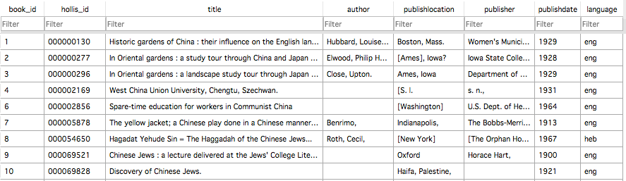

# Database Relazionali

Un database è una raccolta organizzata di dati contenuti in un sistema digitale che ne consente la creazione, la modifica e il recupero. Le query – richieste di dati corrispondenti a un insieme specifico di requisiti formali – consentono di porre domande precise e non ambigue su aspetti di tutti i dati contenuti nel database in un modo a cui il software del database può rispondere efficacemente.

Il tipo più comune di database è un database relazionale, in cui i dati sono strutturati e organizzati concettualmente in una o più tabelle. Ciascuna tabella di un database relazionale è costituita da un insieme di colonne denominate, ciascuna rappresentante un attributo particolare, e righe, ciascuna che rappresenta una relazione tra determinati valori di tali attributi. Molto spesso, ogni riga corrisponde a un'entità concreta – come una persona, un luogo o un oggetto – o un'entità astratta, come una relazione tra due oggetti. Nei database relazionali, viene solitamente utilizzato un linguaggio chiamato Structured Query Language (SQL) per consentire la formulazione precisa di query, nonché istruzioni che descrivono la creazione e la modifica di dati e tabelle in un database.

Esempio:

Il seguente database relazionale descrive un elenco di fondi bibliotecari, un elenco di categorie tematiche e le relazioni tra i due. Ogni libro ha diverse proprietà, come titolo, autore e anno di pubblicazione, e ogni libro può appartenere a un numero qualsiasi di categorie. Ogni categoria può applicarsi allo stesso modo a qualsiasi numero di libri. Il database è composto da tre tabelle di dati:

1. Una tabella "libro", in cui ogni riga contiene informazioni su un libro.
2. Una tabella "categoria", in cui ogni riga contiene informazioni su una categoria.
3. Una tabella “hascategory”, in cui ogni riga rappresenta il fatto che un determinato libro appartiene a una particolare categoria.

La _tavola_ del libro:

La _categoria_ del libro:

.png>)

La tabella “hascategory”

.png>)

In questo esempio, le tre tabelle sono correlate logicamente attraverso l'uso condiviso di identificatori per singoli libri (i numeri nelle due colonne book\_id) e singole categorie (i numeri nelle due colonne category\_id). Questa relazione logica può essere rappresentata come segue:

.png>)

Ogni riga nella tabella hascategory registra l'identificatore di un libro e l'identificatore di una categoria a cui appartiene quel libro. La prima riga mette in relazione il libro con book\_id 1 alla categoria con category\_id 1, rappresentando il fatto che il libro intitolato “Giardini storici della Cina” appartiene alla categoria “Giardini”. Allo stesso modo, la seconda riga rappresenta il fatto che "Nei giardini orientali: un viaggio di studio attraverso la Cina e il Giappone" appartiene a "Gardens, Japanese", e la terza riga il fatto che lo stesso libro appartiene anche a "Gardens, Oriental". La quarta riga rappresenta il fatto che un altro libro, "Nei giardini orientali: un viaggio di studio del paesaggio attraverso il Giappone e la Cina", appartiene anche alla stessa categoria di "Giardini orientali". Rappresentare le stesse informazioni utilizzando un'unica tabella di dati sarebbe impossibile senza dover ripetere le informazioni sullo stesso libro in più righe, utilizzare più colonne per rappresentare le molte categorie a cui può appartenere un libro o registrare tutte le categorie in una sola colonna. Questo è quindi un esempio di un semplice set di dati che può essere modellato in modo più naturale utilizzando più di una tabella.

#### Casi d'uso:

I database sono spesso utilizzati nei casi in cui è necessario archiviare e interrogare dati strutturati. Ciò include i database di ricerca, in cui i dati modellati sono direttamente di interesse per i ricercatori, ma anche molti casi d'uso indiretti in cui il database stesso può essere strumentale per qualche altro scopo finale. Esempi dei primi sono il [China Biographical Database](https://projects.iq.harvard.edu/cbdb/home) che abbiamo visto in precedenza e il [Ming Qing Women Writing's Project](https://digital.library.mcgill.ca/mingqing/english/index.php), i quali, oltre a fornire altri metodi di accesso, rendono i propri dati scaricabili direttamente come database SQL per uso di ricerca. Esempi di questi ultimi includono la maggior parte dei moderni siti Web e sistemi di gestione dei contenuti (es. Wikipedia, Wordpress, ecc.), molti dei quali sono implementati utilizzando software che memorizzano i contenuti in un sistema di database relazionale allo scopo di gestirli e recuperarli in modo efficace ed efficiente. Le applicazioni per smartphone e i sistemi operativi per computer come Windows e Mac OS fanno spesso uso di database per numerosi scopi interni. In questi ultimi casi, spesso il database ei suoi contenuti sono progettati per essere utilizzati principalmente o esclusivamente in combinazione con software di supporto che dialogano internamente con il database in risposta alle richieste dell'utente.

In molti casi, i database di ricerca (in particolare quelli creati da fornitori commerciali) sono progettati anche per essere utilizzati in quest'ultimo modo, mediato solo attraverso interfacce software associate. In questo caso, i ricercatori potrebbero non avere accesso diretto al database relazionale stesso se non attraverso un'autorizzazione speciale del fornitore del database e l'interfaccia potrebbe non esporre tutti i dati in un modo direttamente corrispondente alla rappresentazione sottostante dei dati nelle tabelle. In questi casi, il confine tra database relazionale e database generale o repository diventa meno netto, perché potrebbe non essere trasparente – o addirittura rilevante – per l'utente se il sistema è implementato come database relazionale se le relazioni non sono direttamente accessibili. Esempi di questo approccio includono:

[OperaBase](https://www.operabase.com/en), un database di spettacoli d'opera in tutto il mondo.&#x20;

[Getty Provenance Index](http://www.getty.edu/research/tools/provenance/faq.html), un database di informazioni sulla provenienza delle opere artistiche.
