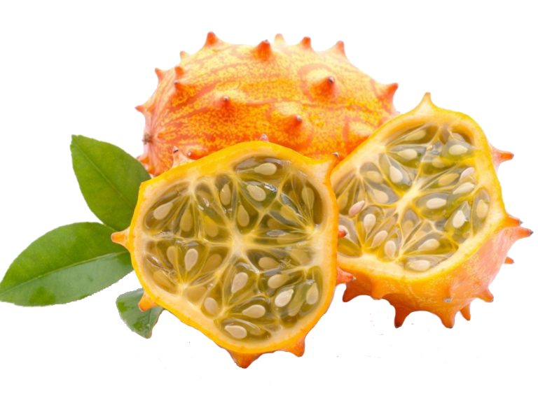
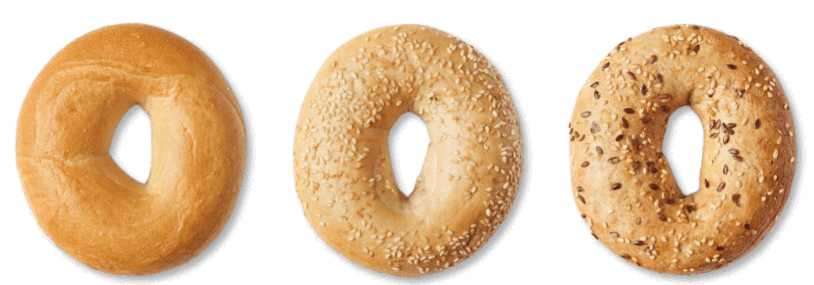

# Supervised Classifiers

Nella lezione [Un Esempio di Topic Modeling](../topic-modeling/topic-modeling-case-study.md), abbiamo parlato di  **unsupervised classification** ovvero classificazione non supervisionata, perché chiediamo al computer di analizzare e contrassegnare un testo senza dargli indicazioni precise _ex ante_: infatti, quando il topic modeling esplora i testi per trovare i discorsi sottostanti presenti al loro interno, i nostri testi non sono stati etichettati in alcun modo. Non abbiamo detto "topic modeling attivati ed cerca un argomento chiamato 'medicina". Un argomento di medicina consisterà principalmente nelle parole "anatomia", "scienza", "ospedale" ecc. Fammi sapere cos'altro trovi!" . Al contrario, il software di topic modeling ha prodotto gruppi di parole che pensava fossero correlate con un input relativamente limitato da parte nostra. Questo ha il vantaggio di mostrarci schemi della cui esistenza potremmo non esserci resi conto. Il topic modeling è utile proprio per esplorare un corpus e scoprire nuove cose su di esso.

Potresti pensare che l'**unsupervised classification** sia simile ad una [roomba](https://www.youtube.com/watch?v=A0Z79ycisDU). Premi un pulsante e il minuscolo robottino esce diligentemente e inizia a pulire il pavimento. Sa quando raggiunge pareti e angoli. E le sue spazzole per la pulizia girano furiosamente per tutto il tempo. Non hai detto alla macchina come pulire o come muoversi sul pavimento. Basta premere il pulsante e confidare che abbia presupposti e protocolli intrinseci adeguati da seguire. Ciò copre la dimensione di _**non supervisione**_, ma una _**classificazione** _ non supervisionata è  più sofisticata di una roomba e diversa nella qualità: infatti, invece di limitarsi a pulire il pavimento, il topic modeling utilizza la statistica per **ordinare** le parole nei tuoi testi in modo tale da poter avere un'idea degli schemi sottostanti l'uso delle parole presenti.

Proviamo un altro esempio, adattato dal [farmers' market game](https://github.com/lmrhody/topicmodelgame) (gioco del mercato degli agricoltori) di Lisa Rhody che insegna appunto il topic modeling. Immagina di avere una borsa con dentro mele, arance e banane. Immagina anche di non avere idea di cosa siano una mela, un'arancia o una banana. Ora ti vienedetto di ordinare le cose nella borsa. Probabilmente puoi ordinare i frutti anche senza sapere nulla di loro e lo faresti creando tre pile. Prendi il primo frutto e lo metti in una pila da solo. Estrai un secondo frutto. Sembra simile al primo? No? Allora crei una nuova pila. Terzo frutto? Sembra il primo, quindi va accanto a quello. Ogni volta che ne estrai uno nuovo, lo confronti con tutti gli altri e rivedi le tue pile di conseguenza. Alla fine, avrai tre diverse pile, organizzate per frutta. Ma non sapevi nulla di quei frutti in anticipo. La modellazione degli argomenti utilizza alcune altre variabili nel processo, quindi se vuoi dai un'occhiata alla lezione di Rhody per saperne di più. Ma non è affatto necessario. Per ora andremo avanti.

Ora immagina, invece, che ti venga dato un esercizio leggermente diverso. Ti viene data una borsa piena di frutti del drago, frutti di stella e durian. Immagina di non sapere nulla di questi frutti. Diciamo "trovami tutti i durian". Puoi ordinare la frutta in pile tutto il giorno, ma, se non sai nulla dei durian, non sarai in grado di raccogliere la frutta di cui hai bisogno. Quindi ti diamo un po' di **training**/formazione portando prima dieci esempi di durian da studiare. Diciamo: "Guardali. Studiali. Presta attenzione a queste caratteristiche: i durian hanno spuntoni (spikes), sono grandi(big) e sono giallastri (yellow-ish)". Potrebbero anche esserti dati diversi esempi di frutta non durian in modo che tu possa avere un'idea di come non il durian non sia. Questo set di frutta nel quale ti vengono dette le etichette corrette, è chiamato il nostro **training set**/set di formazione. Ora hai qualcosa con cui lavorare! Tiri fuori un frutto. Nessuno spuntone. Quindi inizi una pila chiamata non durian. Il successiovo ha degli spuntoni:  è un durian! Continui finché non hai due pile, una che contiene frutta che ritieni sia un durian e una che contiene frutta che pensi non lo sia.


Questo tipo di classificazione è chiamato **supervised classification**,  cioè prima di attivarti, cioè prima di poter davvero fare qualsiasi cosa, ti è stato insegnato quali siano le caratteristiche di un durian. Chiameremmo questa raccolta di caratteristiche un **feature set** (set di caratteristiche) e potrebbe assomigliare a questo sotto:

```
feature_set = {
'has_spikes': True,
'size': 'big',
'color': 'yellow-ish'
}
```

Non preoccuparti troppo delle parentesi, del segno di uguale, ecc. Questi sono solo un modo convenzionale di organizzare le informazioni cosicché il computer possa leggerle. Qui, stiamo solo dicendo che questo feature set definisce l'aspetto di un durian: il frutto deve avere spuntoni, essere grande e giallastro. Questo ci permette di fare un'ipotesi ragionevole sul fatto che qualsiasi frutto che tiriamo fuori dal sacchetto sia o meno un durian. Nota che puoi lavorare solo in modalità binaria: il frutto è un durian o non è un durian. La tua pila di non durian conteneva dunqe frutti di stelle e frutti del drago, dal momento che non sei in grado di distinguere tra i due in questo esperimento immaginario. Se tirassimo fuori una carambola, potremmo solo rispondere che non è un durin nel modo che segue:

```
fruit.is_durian?
>>> False
```

O così, se invece stessimo guardando proprio un durian:

```
fruit.is_durian?
>>> True
```

Il test è in realtà piuttosto semplice nei risultati, anche se il features set che li porta a produrli è più sfumato. **** In programmazione True e False sono indicati come **boolean data types;** questi valori booleani vengono utilizzati per verificare o rappresentare se qualcosa è proprio questo, vero o falso.&#x20;


In informatica, una **variabile booleana**, o semplicemente **booleano**, è un tipo di dato che assume valori "booleani", ovvero soltanto due possibili valori che rappresentano il valore di verità. Tipicamente i due possibili valori sono indicati come "vero" o "falso" (in inglese "true" o "false") oppure come 1 o 0.


Nell'esprimento immaginario appena discusso, abbiamo sviluppato una serie di test riferita ai tipi di frutta che potrebbero non essere perfettamente corretti: dopo tutto, ci sono altri frutti che sono grandi, provvisti di spuntoni e giallastri. Un melone kiwano potrebbe essere stato gettato nel mix e potresti averlo identificato erroneamente come durian. Oppure potresti aver preso un durian acerbo, che hai gettato erroneamente nella pila sbagliata perché era verde. Quindi potremmo caratterizzare meglio le nostre due pile come "probabilmente non durian" e "probabilmente durian".



Allo stesso modo, forse vuoi trovare un sistema di classificazione per ordinare i bagel. Quindi chiedi: è rotondo? Sì. Allora è un bagel. Ha punti neri? Quindi, è un bagel ai semi di papavero. Ha punti bianchi? Quindi è un bagel ai semi di sesamo. Nessuno? Prevalentemente di colore marrone chiaro? Allora è un semplice bagel.



Ma aspetta: questo cane soddisfa tutti i criteri per un semplice bagel e sicuramente non è un bagel. Il nostro classificatore può dire, nella migliore delle ipotesi, "probabilmente bagel" o "probabilmente non bagel". E a volte è sbagliato. A volte la vita ti dà un cane e tutto ciò che puoi vedere è un bagel. (Vai [qui](https://www.boredpanda.com/dog-food-comparison-bagel-muffin-lookalike-teenybiscuit-karen-zack/) per ulteriori informazioni su questo problema di classificazione.)


L'uso della parola "probabilmente" dovrebbe essere un indizio che siamo passati alla probabilità e alla statistica. Quello che abbiamo sviluppato sopra sono **naive Bayes classifiers** molto semplici. Thomas Bayes era uno statistico del diciottesimo secolo e questo classificatore si basa sulla sua teoria statistica. Esistono altri tipi di classificatori, ma questo tipo presuppone che ogni caratteristica (dimensione, colore, spigolosità nell'esempio della frutta; forma e puntinatura nell'esempio del bagel) nel nostro set di funzioni abbia voce in capitolo nel determinare come classificare qualcosa che è sconosciuto.

In una situazione del mondo reale, probabilmente ti sarebbero stati forniti anche esempi negativi, cioè esempi di frutta che non sono durian in modo da avere un'idea più sfumata di ciò che stavi studiando. Nel caso di un naive Bayes classifier e del nostro esempio di frutta, il classificatore prende come **prior probability/**probabilità a priori il numero di volte in cui il durian si è effettivamente presentato nel nostro set di addestramento. Il classificatore combina quindi questo numero con le caratteristiche effettive che abbiamo fornito per dare una probabilità ponderata se ciò che sta guardando sia o meno un durian.

In questo caso, le nostre etichette sono durian o non durian, vero o falso, anche se potresti avere più di due etichette. Il classificatore quindi seleziona l'etichetta con la probabilità maggiore. Ci siamo allenati a classificare la frutta e potremmo replicare lo stesso processo sul durian in un secondo momento. Se arriva un mastro fruttivendolo, potrebbe probabilmente dirci quanto siamo stati precisi. Potremmo quindi confrontare la nostra precisione con quella di un'altra persona esperta nel classificare la frutta e potremmo capire chi è il classificatore migliore. Potremmo anche capire la percentuale di volte in cui ciascuno dei nostri sistemi di classificazione è probabile che sia corretto!

Tutto ciò potrebbe sembrare un po' lontano dal tipo di lavoro che abbiamo svolto in altre parti del libro. Presenta un orizzonte molto tecnico con un linguaggio semplice ed esempi al limite dela banalità. Ciò è stato fatto con il preciso obiettivo che tu vedessi in modo comprensibile i meccanismi sottesi alla classificazione,  prima di procedere all'utilizzo di software che usano questi algoritmi per analizzare set di dati testuali.&#x20;

### Topic Classification

metti sintesi el quaderbnetto ed esempi

## Further Resources

* Il libro sul  [NLTK](https://www.nltk.org) (Natural Language Toolkit) presenta [una valida sezione](http://www.nltk.org/book/ch06.html#naive-bayes-classifiers) sui naive Bayes classifiers. Il libro è un tutorial di Python ed ha una dimensione molto tecnica.
* [A Visual Introduction to Machine Learning](http://www.r2d3.us/visual-intro-to-machine-learning-part-1/) fornisce un'introduzione ad altri tipi di classificatori.
* Fabio Ciotti, [What's in a Topic Model? Critica teorica di un metodo computazionale per l’analisi del testo. Testo & Senson.18, 2017](https://testoesenso.it/index.php/testoesenso/article/view/370/pdf\_227). L'interessante articolo si propone di affrontare criticamente, i fondamenti teorici di una nozione e di un metodo che sono oggi molto diffusi negli studi letterari computazionali, il topic modeling, appunto, inteso come l'individuazione statistico/probabilistica dei cluster lessicali che caratterizzano un insieme di testi, e l'analisi delle loro distribuzioni. Quando parla di fondamenti teorici si riferisce al ruolo che tale nozione può giocare nel contesto di una teoria del testo e di una metodologia della critica letteraria, e non ai suoi aspetti puramente matematici, che sono ovviamente saldamente basati sulla statistica e sulla teoria della probabilità bayesiana. Dopo una descrizione dei fondamenti tecnici della nozione di topic modelling procede a confrontare tale nozione con alcuni suoi possibili correlati in ambito teorico letterario, evidenziando i limiti di ogni possibile identificazione.
