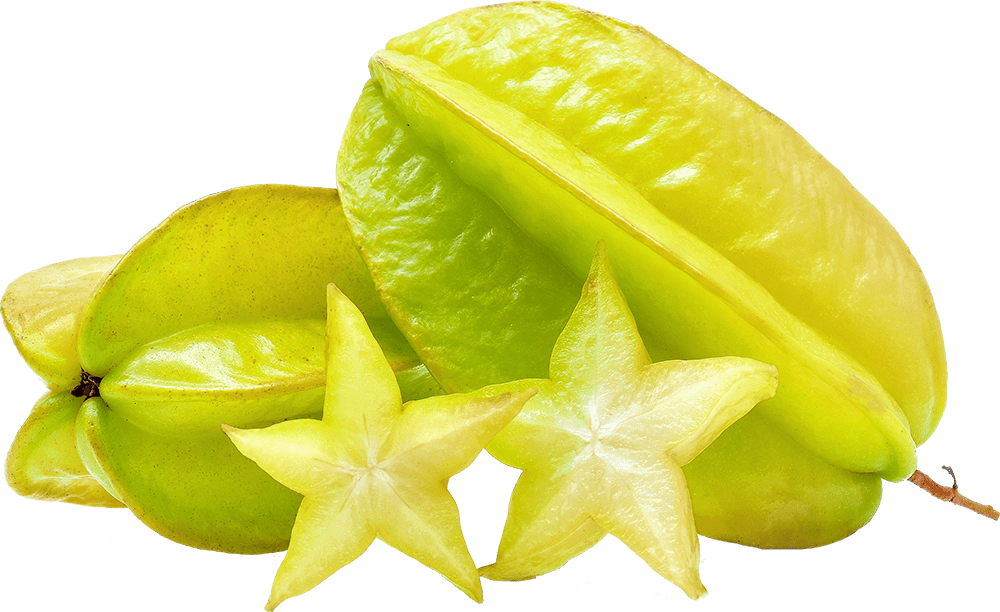

# Supervised Classifiers

Nella lezione [Un Esempio di Topic Modeling](../topic-modeling/topic-modeling-case-study.md), abbiamo parlato di  **unsupervised classification** ovvero classificazione non supervisionata, perché chiediamo al computer di analizzare e contrassegnare un testo senza dargli indicazioni chiare. Quando il topic modeling esplora i testi per trovare i discorsi sottostanti presenti al loro interno, i nostri testi non sono stati etichettati in alcun modo. Non abbiamo detto "topic modeling attivati ed cerca un argomento chiamato 'medicina". Un argomento di medicina consisterà principalmente nelle parole "anatomia", "scienza", "ospedale" ecc. Fammi sapere cos'altro trovi!" , Al contrario, il software di topic modeling ha prodotto gruppi di parole che pensava fossero correlate con un input relativamente limitato da parte nostra. Questo ha il vantaggio di mostrarci schemi di cui potremmo non sapere nemmeno l'esistenza. Il topic modeling è utile proprio per esplorare un corpus e scoprire nuove cose su di esso.

Potresti pensare che l'**unsupervised classification** sia simile au una [roomba](https://www.youtube.com/watch?v=A0Z79ycisDU). Premi un pulsante e il minuscolo robottino esce diligentemente e inizia a pulire il pavimento. Sa quando raggiunge pareti e angoli. E le sue spazzole per la pulizia girano furiosamente per tutto il tempo. Non hai detto alla macchina come pulire o come muoversi nel pavimento. Basta premere il pulsante e confidare che abbia presupposti e protocolli intrinseci da seguire. Ciò copre la dimensione di _non supervisione_, ma un _classificatore_ non supervisionato è  più sofisticato e diverso nella qualità infatti, invece di limitarsi a pulire il pavimento, il topic modeling utilizza la statistica per ordinare le parole nei tuoi testi in modo tale da poter avere un'idea degli schemi sottostanti l'uso delle parole presenti.

Proviamo un altro esempio, adattato dal [farmers' market game](https://github.com/lmrhody/topicmodelgame) (gioco del mercato degli agricoltori) di Lisa Rhody che insegna appunto il topic modeling. Immagina di avere una borsa con dentro mele, arance e banane. Immagina anche di non avere idea di cosa siano una mela, un'arancia o una banana. Ora ti diciamo di ordinare le cose nella borsa. Probabilmente puoi ancora ordinare i frutti anche senza sapere nulla di loro e lo faresti creando tre pile. Prendi il primo oggetto e lo metti in una pila da solo. Estrai un secondo oggetto. Sembra simile al primo? No? Crei una nuova pila. Terzo oggetto? Sembra il primo, quindi va accanto a quello. Ogni volta che estrai un nuovo oggetto, lo confronti con tutti gli altri e rivedi le tue pile di conseguenza. Alla fine, avrai tre diverse pile, organizzate per frutta. Ma non sapevi nulla di quei frutti in anticipo. La modellazione degli argomenti utilizza alcune altre variabili nel processo, quindi se vuoi dai un'occhiata alla lezione di Rhody per saperne di più. Ma non è necessario. Per ora andremo avanti.

Now imagine, instead, that we give you a slightly different exercise. We give you a bag filled with dragon fruit, star fruit, and durian. Imagine that you don't know anything about these fruits. We say, "find me all the durian." You could sort the fruit into piles all day long, but, if you don't know anything about durian, you won't be able to pick out the fruit you need. So we give you a little **training** by first bringing in ten examples of durian for you to study. We say, "Look at them. Study them. Pay attention to these characteristics: durian have spikes, they are big, and they are yellow-ish." We might also give you several examples of non-durian fruit so that you can get a sense of what durian doesn't look like. This set of fruit, where we tell you the correct labels for the fruit, is called our **training set**. Now, you have something to work with! You pull a fruit. No spikes. So you start a pile called not durian. The next one has spikes. Durian! You keep going until you have two piles, one that contains fruit that you think is a durian and one that contains fruit that you think are not.

Ora immagina, invece, che ti diamo un esercizio leggermente diverso. Ti diamo una borsa piena di frutti del drago, frutti di stella e durian. Immagina di non sapere nulla di questi frutti. Diciamo "trovami tutto il durian". Puoi ordinare la frutta in pile tutto il giorno, ma, se non sai nulla di durian, non sarai in grado di raccogliere la frutta di cui hai bisogno. Quindi ti diamo un po' di formazione portando prima dieci esempi di durian da studiare. Diciamo: "Guardali. Studiali. Presta attenzione a queste caratteristiche: i durian hanno punte, sono grandi e sono giallastri". Potremmo anche darti diversi esempi di frutta non durian in modo che tu possa avere un'idea di come non appare il durian. Questo set di frutta, dove ti diciamo le etichette corrette per la frutta, è chiamato il nostro set di formazione. Ora hai qualcosa con cui lavorare! Tiri un frutto. Nessun picco. Quindi inizi una pila chiamata non durian. Il prossimo ha dei picchi. Duriano! Continua finché non hai due pile, una che contiene frutta che ritieni sia un durian e una che contiene frutta che pensi non lo siano.





Questo tipo di classificazione è chiamato **supervised classification**. Avrebbe dovuto esserti insegnato quali fossero le caratteristiche di un durian prima di poter davvero fare qualsiasi cosa. Chiameremmo questa raccolta di tratti un **feature set** (set di funzionalità) e potrebbe assomigliare a questo sotto:

```
feature_set = {
'has_spikes': True,
'size': 'big',
'color': 'yellow-ish'
}
```

Don't worry too much about the brackets, equals sign, etc. These are just a common way of organizing the information so that the computer can read them. Here, we're just saying that this feature set defines what a durian looks like: the fruit has to have spikes, be large, and yellow-ish. This allows us to make a reasonable guess as to whether or not any one piece of fruit we pull out of the bag was a durian. Notice how you can only work in binaries: the fruit is either a durian or not. Your not-durian pile had star fruit and dragon fruit in it, since you weren't really able to distinguish between the two in this thought experiment. If we pulled out a star fruit, we could only answer something like the following:

```
fruit.is_durian?
>>> False
```

Or this if we were looking at a durian:

```
fruit.is_durian?
>>> True
```

The test is actually pretty simple in its results, even if the feature set that leads to them is more nuanced. True and False are referred to as **boolean data types** in programming, and these boolean values are used to test or represent whether something is just that - true or false.

We have been developing a series of tests for fruit types, but they might not be perfectly correct: after all, there are other fruits that are large, spikey and yellow-ish. A kiwano melon could have gotten thrown into the mix, and you might have incorrectly identified it as a durian. Or you might have gotten an unripe durian, which you incorrectly tossed in the wrong pile because it was green. So we could better characterize our two piles as "probably not durian" and "probably durian."

Likewise, maybe you want to figure out a classification system to sort bagels. So you ask: is it round? Yes. Then it's a bagel. Does it have black dots? Then it's a poppy-seed bagel. Does it have white dots? Then it's a sesame-seed bagel. Neither one? Mainly light brown in color? Then it's a plain bagel.


But wait: this dog fits all the criteria for a plain bagel, and it is definitely not a bagel. Our classifier can say, at best, "probably bagel" or "probably not bagel." And sometimes it's wrong. Sometimes life gives you a dog, and all you can see is a bagel. (Go [here](http://www.boredpanda.com/dog-food-comparison-bagel-muffin-lookalike-teenybiscuit-karen-zack/) for more on this classification problem.)

The use of the word "probably" should be a clue here - we have drifted into probability and statistics. What we have developed above are very basic **naive Bayes classifiers**. Thomas Bayes was an eighteenth-century statistician, and this classifier relies on his underlying [theory of statistics](https://en.wikipedia.org/wiki/Bayesian\_statistics). There are other types of classifiers, but this kind assumes that each feature (size, color, spikiness in the fruit example; shape and dotted-ness in the bagel example) in our feature set will have some say in determining how to classify something that is unknown.

In a real-world situation, we probably would have given you negative examples as well, examples of fruit that are not durian so that you had a more nuanced sense of what you were studying. In the case of a naive Bayes classifier and our fruit example, the classifier takes the number of times that durian actually occurred in our training set as the **prior probability**. The classifier then combines this number with the actual features that we provided to give a weighted probability as to whether or not what it is looking at is a durian.

In this case, our labels are durian or not-durian, true or false, though you could have more than just two labels. The classifier then picks the label with the highest likelihood. We have trained ourselves to classify fruit, and we could replicate that same process on durian at a later date. If a master fruit vendor comes along, she could probably tell us how accurate we were. We could then compare our accuracy to that of another person trained to classify fruit, and we could figure out who is the better classifier. We could even figure out the percentage of the time that each of our classification systems is likely to be correct!

This might all seem a bit removed from the kinds of work that we have been doing elsewhere in the book, but we wanted you to give a firm foundation in what classification is before we modeled an example relative to text analysis.

## Further Resources

* The NLTK book has [a good section](http://www.nltk.org/book/ch06.html#naive-bayes-classifiers) on naive Bayes classifiers. The book is a Python tutorial, though, so it will quickly get technical.
* [A Visual Introduction to Machine Learning](http://www.r2d3.us/visual-intro-to-machine-learning-part-1/) provides a very handy introduction to other types of classifiers.
