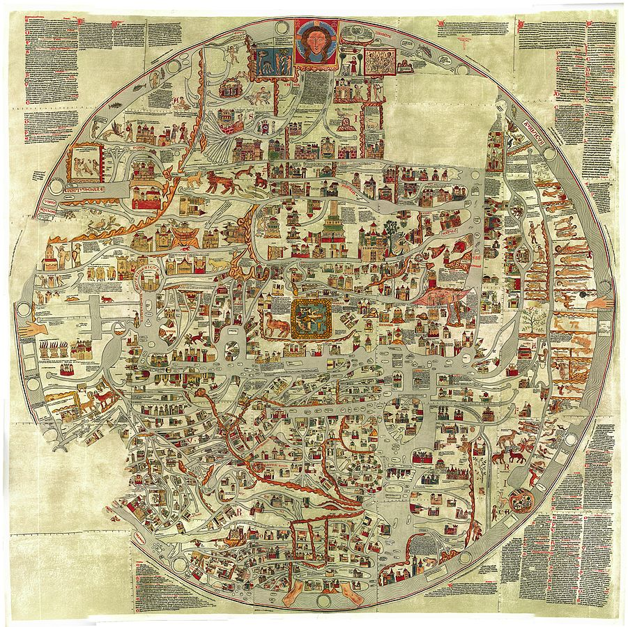

# Cosa fare

Nelle sezioni precedenti abbiamo visto degli esempi e moltissimi strumenti.

Ma c'è un problema comune nel lavorare con i dati spaziali (o, come abbiamo visto, con qualsiasi tipo di dato). Una volta acquisita una ragionevole competenza nella creazione di mappe, il processo effettivo di creazione delle mappe può procedere molto rapidamente. Viene dedicato molto più tempo alla **ricerca o alla creazione, pulizia e preparazione dei dati**. Inoltre, il processo di creazione delle mappe è ripetibile da una mappa all'altra. Una volta che si è imparato a creare un certo tipo di mappa, creare la seconda, la terza o la decima mappa è molto più semplice. Ma ogni nuovo progetto comporta le stesse sfide di trovare e preparare i dati. Questo lavoro è altamente specifico per i set di dati o le fonti primarie in questione. L'abilità di creare, pulire e manipolare i dati può essere appresa, ma le tecniche sono difficili da distillare in un tutorial o in una serie di passaggi. Ad ogni buon conto il flow può essere come quello che vedi sotto:


Poi si tratta di capire **cosa fare.**

* L'abilità più importante che gli studenti possono apprendere sulle mappe nelle discipline umanistiche è l'alfabetizzazione spaziale. Come si legge una mappa? Questo può significare introdurre letteralmente gli studenti alle convenzioni di base delle mappe. Ma soprattutto significa imparare a leggere le mappe del passato come fonti primarie, e come leggere le mappe degli studiosi come fonti secondarie, e come leggere i testi tenendo conto dei loro contesti spaziali.
* Una **mappa narrativa** racconta una storia tracciata attraverso lo spazio. Il punto di una mappa narrativa non è visualizzare i dati. Piuttosto è fornire una controparte visiva esplicita alle implicite basi spaziali di una narrazione o di un argomento. Le mappe narrative sono ampiamente utili in tutte le discipline, poiché molti testi hanno una componente spaziale. Ad esempio, una lezione di letteratura potrebbe chiedere agli studenti di tracciare i movimenti dei personaggi all'interno dei [Dubliners](http://s3.amazonaws.com/uploads.knightlab.com/storymapjs/de923c6d12a51c1e4f77c1dbb66a81cc/dubliners-the-encounter/index.html) di James Joyce o di qualche altra opera letteraria. Un'altra classe potrebbe cercare i movimenti di Agostino d'Ippona nel Mediterraneo. Una lezione di arte o musica potrebbe seguire lo sviluppo di determinati tipi di pittura o stili musicali nello spazio.&#x20;


Insieme proveremo a fare una mappa narrativa riferita ad Agoastino di Ippona usando StoryMap. Ci sono molte copie online delle [Confessioni di Agostino](https://www.augustinus.it/italiano/confessioni/index2.htm).  Nel 1464-65, il pittore italiano Benozzo Gozzoli dipinse diciassette affreschi della vita di Agostino per la cappella della chiesa di Sant'Agostino. Puoi trovare fotografie di queste scene nella [Web Gallery of Art](https://www.wga.hu/frames-e.html?/html/g/gozzoli/4gimigna/index.html). Questi dipinti forniscono anche una chiave per capire i luoghi in cui viaggiò Agostino.


* Uno dei tipi più comuni di mappe che gli studiosi vogliono creare sono le **mappe tematiche**. Queste mappe mostrano una o più variabili (o temi) disposte spazialmente su una mappa. A volte i dati sono disposti sopra uno strato di base cartografico; altre volte, come in un cartogramma, la disposizione spaziale è solo approssimativa. Sebbene tali mappe siano oggi sempre più comuni, il loro lignaggio risale almeno al diciannovesimo secolo.&#x20;
*   La **georettifica** è il processo di acquisizione di un'immagine di una mappa e di creazione di un riferimento ad una griglia spaziale, in modo che l'immagine della mappa possa essere utilizzata come un layer in altre mappe, o in modo che l'immagine della mappa possa a sua volta essere utilizzata per associare i punti di interesse alla griglia spaziale. Ad esempio, si potrebbe georettificare una mappa di una città, quindi utilizzare quella mappa georettifica per trovare le latitudini e le longitudini degli edifici sulla mappa.

    In altre parole, si confrontano punti tra una mappa storica e un modo contemporaneo di tenere traccia dei dati spaziali. Un algoritmo lavora su quei punti per deformare la mappa in modo che tutte le parti di essa siano allineate alla griglia. Puoi vedere degli esempi e crearne tu stesso in [MapWarper](https://mapwarper.net).


* **Deep maps = Space vs. place:** si tratta di mappe di un luogo piuttosto che di uno spazio. I geografi spesso distinguono tra _luogo_ e _spazio_ . Lo _spazio_ è la griglia di riferimento che utilizziamo per creare mappe: 31.7833° N, 35.2167° E è un puntatore nello spazio. Il _luogo_, invece, è il significato che si ricava dallo spazio. La latitudine e la longitudine sono lo spazio, ma il luogo è Gerusalemme, un luogo con innumerevoli significati contestati ad essa collegati. Come ulteriore illustrazione della differenza tra spazio e luogo, i nostri moderni sistemi di riferimento di coordinate prendono il loro punto di origine 0°, 0°, un punto nell'Oceano Atlantico al largo della costa occidentale dell'Africa: [Isola Null](http://en.wikipedia.org/wiki/Null\_Island) . Questa riproduzione della mappa di Ebstorf del XIII secolo, tuttavia, prende come punto centrale Gerusalemme e carica la città di immagini simboliche religiose.



Il geografo Tim Cresswell definisce i luoghi come segue:

> Il luogo è il modo in cui rendiamo significativo il mondo e il modo in cui viviamo il mondo. Il luogo, a livello di base, è spazio investito di significato nel contesto del potere. Questo processo di investimento dello spazio con significato avviene in tutto il mondo a tutte le scale e si è verificato nel corso della storia umana. Dare un senso a questo è stato uno dei compiti centrali della geografia umana (Tim Cresswell, _Place: An Introduction_, 2nd ed. (J. Wiley & Sons, 2015), 19).

* Mappe fatte con linguaggi di programmazione. Gli strumenti di cui abbiamo parlato finora, si servono interfacce utente grafiche (GUI). Tuttavia, esiste un modo completamente diverso per creare mappe, ovvero utilizzando linguaggi di programmazione per computer. Considera il codice di esempio di seguito. Queste cinque righe di codice creano la mappa sottostante di un incontro tra navi americane e francesi durante la Quasi Guerra. [1](https://lincolnmullen.com/projects/spatial-workshop/programmatic-maps.html#fn1) Per ora, non rimanere bloccato sui dettagli del codice.

```
library(leaflet)
quasi <- read.csv("data/quasi-wars.csv")
leaflet(quasi) %>% 
  addTiles() %>% 
  addCircles(popup = ~engagement_type)

```


C'è una differenza significativa tra il modo in cui questa mappa è stata creata e il modo in cui sone create le mappe utilizzando le GUI. Nelle GUI dovevamo puntare e cliccare, ed è difficile spiegare cosa abbiamo fatto e riprodurlo o ripeterlo. Tuttavia, creando questa mappa con il codice, in linea di principio possiamo ispezionare e spiegare ogni passaggio lungo il percorso, anche se il linguaggio richiede un po' di tempo per abituarsi. Ad esempio, possiamo leggere questo codice e osservare che la riga `addTiles()`aggiunge i riquadri di Open Street Map alla mappa, e possiamo supporre che se omettessimo quella riga non otterremmo riquadri e se aggiungessimo qualche informazione in più  potremmo ottenere informazioni diverse. Oppure, possiamo osservare che la funzione `addCircles()` aggiunge piccoli cerchi blu alla mappa e possiamo supporre che potremmo usare quella funzione per aggiungere grandi cerchi rossi, o anche che cambiare la funzione in qualcosa di diverso potrebbe darci un tipo diverso di indicatore del tutto. Il principio è che il linguaggio di programmazione consente di specificare esattamente ciò che vogliamo.&#x20;

L'uso del codice del computer apre anche la possibilità che possiamo manipolare i nostri dati in modi molto più potenti di quelli consentiti dai nostri strumenti GUI. Considera questo esempio.

```
library(dplyr)
quasi %>% 
  filter(as.Date(date) < as.Date("1798-12-31"))
```

```
## Source: local data frame [38 x 13]
## 
##          date   ship_1_name         ship_1_type ship_1_nationality
## 1  1798-09-28       America armed merchant ship                USA
## 2  1798-07-11      American armed merchant ship                USA
## 3  1798-09-27    Amphitrite armed merchant ship                USA
## 4  1798-05-09     Belvedere armed merchant ship                USA
## 5  1798-04-22 Boston Packet          armed brig                USA
## 6  1798-12-28       Camilla armed merchant ship                USA
## 7  1798-09-25    Carrollton armed merchant ship                USA
## 8  1798-09-27          Cato armed merchant ship                USA
## 9  1798-12-20        Chance      armed schooner                USA
## 10 1798-05-25         Diana armed merchant ship                USA
## ..        ...           ...                 ...                ...
## Variables not shown: ship_2_name (fctr), ship_2_nationality (fctr),
##   location (fctr), lat (dbl), long (dbl), outcome (fctr), source (fctr),
##   engagement_type (fctr), status (fctr)
```

Queste poche righe di codice potrebbero sembrare un po' criptiche, ma guardandole possiamo capire che stiamo prendendo i dati [Quasi War](http://abbymullen.org/projects/Quasi-War/) (nella variabile chiamata `quasi`) e prendiamo solo gli eventi accaduti prima della fine dell'anno 1798.

Noi possiamo sicuramente creare tutte le mappe di cui abbiamo bisogno usando gli strumenti della GUI che abbiamo esplorato in questa unità, ma scrivere il codice ci offrirebbe un mezzo più potente, flessibile e preciso per creare mappe. Lo scopo quindi è renderti consapevole delle possibilità di ciò che si può fare imparando i rudimenti di un [linguaggio di programmazione](https://www.w3schools.com/r/default.asp).

### Formati di dati

**CSV o fogli di calcolo**

I file di valori separati da virgola contengono dati punto in formato tabulare. A volte questi dati sono contenuti in file Excel e dovrebbero essere esportati in file CSV il prima possibile.&#x20;

**Shapefile**

[Gli Shapefile](http://en.wikipedia.org/wiki/Shapefile) sono un formato proprietario di ESRI, ma possono essere letti dalla maggior parte dei software di mappatura. Gli Shapefile sono composti da diversi file, che hanno lo stesso nome file ma estensioni diverse. Il `.shp`file contiene le geometrie; il `.prj`file contiene le informazioni sulla proiezione; il `.dbf`file contiene dati aggiuntivi associati alle geometrie; potrebbero esserci anche altri file. Questi file devono essere tenuti insieme affinché lo shapefile funzioni correttamente.

**GeoJSON**

[GeoJSON](http://geojson.org) è un formato aperto per i dati spaziali. È comunemente usato per le mappe web, sebbene possa essere utilizzato anche nelle applicazioni GIS. I file GeoJSON possono essere ispezionati in un editor di testo. [Vedi " Più di quanto tu abbia mai voluto sapere su GeoJSON](http://www.macwright.org/2015/03/23/geojson-second-bite.html) " di Tom MacWright per un'introduzione dettagliata. Un singolo punto GeoJSON potrebbe essere simile al seguente.

```
{
  "type": "FeatureCollection",
  "features": [
    {
      "type": "Feature",
      "properties": {
        "population": 1000000
      },
      "geometry": {
        "type": "Point",
        "coordinates": [
          -56.25,
          -1.7575368113083125
        ]
      }
    }
  ]
}
```

**Formati meno comuni**

[Topojson](https://github.com/mbostock/topojson) è un'estensione di GeoJSON che tiene conto della topologia, il che significa che tiene traccia dei confini condivisi tra i poligoni. È comunemente usato con le mappe realizzate in [D3.js](http://d3js.org) .

[I file KML](https://developers.google.com/kml/) ( `.kml`o `.kmz`) sono comunemente usati in Google Earth o Google Maps.

### Approfondimento

Un ulteriore approfondimento puoi essere fatto nella [pagina curata](https://lincolnmullen.com/projects/spatial-workshop/introduction.html) da Lincoln Mullen che ha fornito preziose informazioni a questa sezione.
